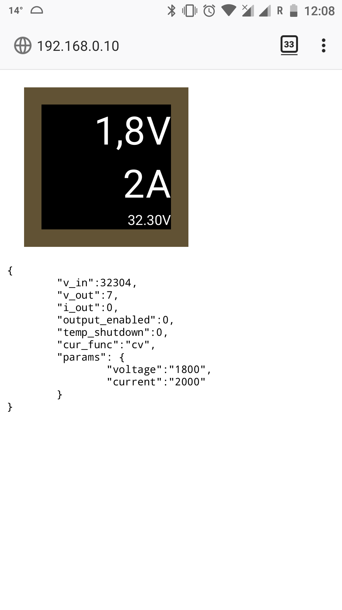

# ESP8266 WiFi for OpenDPS

* autodiscovery using mDNS (http://esp-opendps.local)
* multiuser DPS to TCP proxy (port 5005/TCP)
* USB to DPS proxy (with USB equipped ESP modules)
* WEB server with interface and API (in progress)

